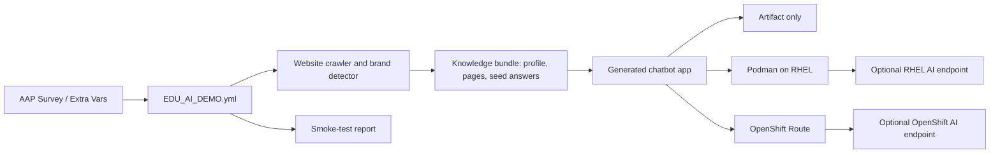

# Architecture

The generated app has two modes:

- **Evidence mode**: default, no model required. It ranks crawled pages, summarizes relevant snippets, and cites source URLs.
- **Model mode**: optional. If `DEMO_LLM_ENDPOINT` is present, the app sends the retrieved context to an OpenAI-compatible endpoint and falls back to evidence mode on error.

## Runtime Modes

`artifact`
: Build only. This is the safest first run and is useful for validating the crawl before a customer demo.

`podman`
: Copy the generated app to a RHEL host, build a Podman image, and run it as a temporary container.

`openshift`
: Create or update an OpenShift namespace, ConfigMap, Deployment, Service, and Route with `oc apply`.

`openshift_ai`
: Same OpenShift app path, plus provider metadata and optional model endpoint environment.

`rhel_ai`
: Same Podman path, plus provider metadata and optional model endpoint environment.

`all`
: Build the artifact and attempt both Podman and OpenShift paths. Use only when inventory and kubeconfig are ready.

## Design Choices

- The crawler is intentionally shallow and bounded by `demo_max_pages`.
- The app is generated with Python standard library only so it can run in a stock UBI Python image.
- The chatbot avoids unverifiable claims. This matters in EDU demos where tuition, enrollment windows, and financial aid details change frequently.
- OpenShift deployment uses a ConfigMap-mounted app for fast iteration. For production-style demos, replace this with a normal image build/push flow.
